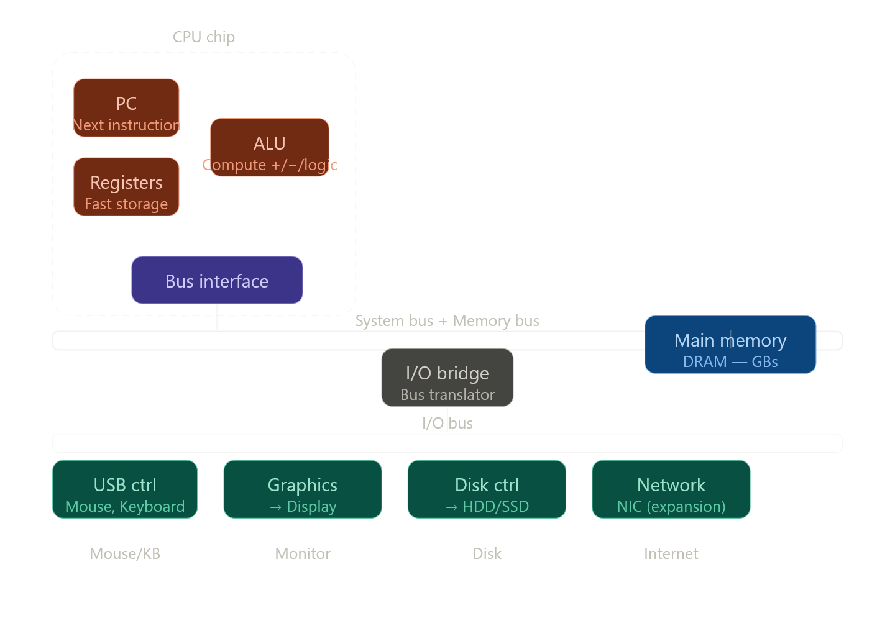

இந்த section-ல இரண்டு parts இருக்கு — Shell என்ன பண்றது, அதற்கு முன்னாடி hardware எப்படி organize ஆகி இருக்கு. Hardware பாத்தா மட்டுமே `./hello` run ஆகும்போது என்ன நடக்குது புரியும். இரண்டையும் deep-ஆ போகிறேன்.

---

# Part 1 — Hardware Organization

## Bus — எல்லாத்தையும் connect பண்ற highwayஒவ்வொரு component-யும் என்ன பண்றது deep-ஆ பாக்கலாம்.



---

## Buses — Data highway

**Bus** = shared electrical wires, multiple components-ஐ connect பண்றது. Data ஒரு fixed chunk size-ல travel பண்றது — இதை **word** னு சொல்வாங்க. Modern 64-bit systems-ல word size = 8 bytes.

மூன்று different buses இருக்கு:

**System bus** — CPU ↔ I/O Bridge. CPU-ரோட speed-க்கு match ஆகுற fast bus.

**Memory bus** — I/O Bridge ↔ Main Memory. Memory access-க்கு dedicated.

**I/O bus** — I/O Bridge ↔ எல்லா devices (disk, USB, graphics). Slower, ஆனா universal — எல்லா devices-உம் ஒரே bus share பண்றது.

I/O Bridge நடுவுல இருந்து இந்த மூன்று buses-ஐயும் translate பண்றது — different speeds-ஐ bridge பண்றது அதோட job.

---

## CPU internals — PC, Registers, ALU

**Program Counter (PC)** — ஒரே ஒரு register, ஆனா மிக முக்கியமான ஒண்ணு. அதுல next execute ஆகவேண்டிய instruction-ரோட **memory address** இருக்கும். CPU ஒரு instruction execute பண்ணும்போது PC automatically next instruction address-க்கு update ஆகும். `jmp` / `call` instructions PC-ஐ manually change பண்றது — அதுதான் branching, function calls எல்லாம்.

**Register file** — CPU chip-ல உள்ளே இருக்கற மிகவும் fast, மிகவும் small storage. x86-64-ல 16 general-purpose registers: `%rax, %rbx, %rcx, %rdx, %rsi, %rdi, %rsp, %rbp, %r8..%r15`. ஒவ்வொண்ணும் 8 bytes. Total = 128 bytes மட்டும்! ஆனா RAM-ஐ விட ~100x fast.

**ALU (Arithmetic Logic Unit)** — actual computation நடக்குற இடம். Addition, subtraction, AND, OR, XOR, comparison — எல்லாம் இங்கே. ALU registers-லிருந்து input எடுக்கும், result registers-ல போடும். RAM-ஐ directly தொடாது — register வழியாதான் எல்லாம்.

---

## Main Memory — DRAM

**DRAM (Dynamic RAM)** — உன் laptop-ல 8GB/16GB RAM. "Dynamic" ஏன்னா ஒவ்வொரு bit-உம் ஒரு capacitor-ல store ஆகுது, அது slowly discharge ஆகும். அதனால milliseconds-ல ஒரு முறை **refresh** பண்ணணும் — அதுவே DRAM-ஐ SRAM-ஐ விட slow பண்றது.

CPU directly RAM address பண்ண முடியும் — `mov (%rdi), %rax` = `rdi` register-ல இருக்கற address-ல memory-லிருந்து 8 bytes எடுத்து `rax`-ல போடு.

---

## I/O Devices

**Disk controller** — HDD/SSD-ஓட intermediary. CPU directly disk-ஐ access பண்ணாது — controller-க்கு command அனுப்பும், controller disk-ஐ handle பண்ணும். DMA (நேத்து பாத்தோம்) இந்த controller use பண்றது.

**Graphics adapter** — `"hello, world\n"` string bytes-ஐ screen-ல pixels-ஆ convert பண்றது. CPU character codes அனுப்பும், adapter அதை render பண்ணும்.

**USB controller** — keyboard, mouse போன்ற devices. Keyboard-ல key press ஆகும்போது USB controller CPU-க்கு **interrupt** அனுப்பும் — CPU என்ன பண்ணிட்டு இருந்தாலும் நிறுத்தி keyboard input process பண்ணும்.

---

# Part 2 — Shell என்னது, என்ன பண்றது?

**Shell** = ஒரு normal user-space program. OS-ரோட part இல்ல. Terminal-ல type பண்றதை படிச்சு, interpret பண்ணி, execute பண்றது மட்டும்தான் வேலை.

```
linux> ./hello
```

இந்த ஒரு line-க்கு shell என்ன பண்றது:

**Step 1 — Prompt print பண்றது**, `linux> ` — just `printf` call.

**Step 2 — Input wait** — `read()` system call. Keyboard character வரும் வரை block ஆகி இருக்கும்.

**Step 3 — Enter press ஆகும்போது** — `./hello` string ready. Shell first word பாக்கும்: `./hello` built-in command-ஆ? (`cd`, `exit`, `echo` மாதிரி built-ins?) இல்லன்னா — executable file னு assume பண்ணும்.

**Step 4 — `fork()` system call** — shell ஒரு child process create பண்றது. Child = shell-ரோட exact copy, same memory, same everything. இப்போ இரண்டு processes இருக்கு: parent shell, child shell-copy.

**Step 5 — child-ல `execve()` system call** — child process-ரோட memory-ஐ `hello` program-ஓட code+data-ஓட replace பண்றது. இனி அந்த process = `hello` program. இங்கேதான் disk-லிருந்து `hello` executable load ஆகுது (DMA வழியா RAM-க்கு).

**Step 6 — parent shell `wait()` call** — child (`hello`) finish ஆகும் வரை parent sleep.

**Step 7 — `hello` program runs** — `main()` execute ஆகும், `printf("hello, world\n")` call ஆகும், string display-ல தெரியும், `return 0` ஆகும்.

**Step 8 — child terminates** — OS child process cleanup பண்றது, parent-க்கு signal அனுப்பும்.

**Step 9 — parent shell `wait()` return** — child முடிஞ்சது தெரியும். மறுபடியும் prompt print பண்ணி next input wait பண்றது.

```
linux>          ← Step 1: prompt
./hello         ← Step 2-3: input read
hello, world    ← Step 7: hello program output
linux>          ← Step 9: back to waiting
```

---

## Fork + Exec — ஏன் இப்படி design பண்ணாங்க?

`fork()` மட்டும் use பண்ணன்னா child parent-ரோட same code run பண்ணும் — useless. `exec()` மட்டும் use பண்ணன்னா current process replace ஆகும் — shell itself gone!

`fork()` + `exec()` combination-ல: shell alive-ஆ இருக்கும் (parent), புது program run ஆகும் (child). இது Unix-ரோட elegant design — ஒவ்வொரு program-உம் isolated process-ல run ஆகுது, shell affect ஆகாது.

இந்த `fork-exec` pattern Node.js-ல `child_process.spawn()` use பண்ணும்போதும் நடக்குது — internally same Linux system calls!

அடுத்து 1.4.2 (Running the hello program — hardware-level detail) போகலாம், அதுல DMA + CPU execution cycle deep-ஆ வருது.

-----

சரி Jarvis! ஒவ்வொரு concept-உம் real example-ஓட, step-by-step memory diagrams-ஓட போகிறேன்.

---

# 1. Buses — Real example-ஓட

Bus என்பது ஒரு highway. ஆனா இந்த highway-ல **ஒரே நேரத்துல ஒருத்தர் மட்டும்** travel பண்ண முடியும் (shared bus). அதனால **bus arbitration** னு ஒரு mechanism இருக்கு — யாருக்கு turn னு decide பண்றது.

உன் laptop-ல `int x = 5;` எழுதினா என்ன நடக்குது:

```
CPU wants to write 5 to RAM address 0x7fff1000

Step 1: CPU → System bus → I/O Bridge
        "Write value 5 to address 0x7fff1000"

Step 2: I/O Bridge → Memory bus → RAM
        RAM[0x7fff1000] = 0x0000000000000005

Total time: ~100 CPU cycles
(ஒரே register assignment: ~1 cycle)
```

Word size = 8 bytes (64-bit) meaning: bus ஒரு trip-ல 8 bytes transport பண்றது. `char` (1 byte) write பண்ணினாலும் 8 bytes travel ஆகும் — bus efficiency-க்காக.

---

# 2. Program Counter — Real execution trace

PC என்பது CPU-ரோட "இப்போ எங்க இருக்கோம்" pointer. ஒரு simple C function பாரு:

```c
int add(int a, int b) {
    int result = a + b;   // line 1
    return result;         // line 2
}
```

Assembly-ல இது இப்படி தெரியும், ஒவ்வொரு instruction-உம் ஒரு memory address-ல இருக்கும்:

```
Address    Instruction
0x401020   push %rbp          ; stack frame setup
0x401021   mov %rsp, %rbp
0x401024   mov %edi, -4(%rbp) ; a store
0x401027   mov %esi, -8(%rbp) ; b store
0x40102a   mov -4(%rbp), %eax ; a load
0x40102d   add -8(%rbp), %eax ; a + b → eax
0x401030   mov %eax, -12(%rbp); result store
0x401033   mov -12(%rbp), %eax; return value
0x401036   pop %rbp
0x401037   ret                ; return
```

PC இப்படி move ஆகும்:

```
PC = 0x401020 → execute push
PC = 0x401021 → execute mov
PC = 0x401024 → execute mov
...ஒவ்வொரு instruction-உம் PC += instruction size
```

`ret` instruction execute ஆகும்போது PC = stack-லிருந்து pop ஆன return address. அதனால function call-க்கு முன்னாடி இருந்த இடத்துல execution continue ஆகும்.

**`jmp` example — if-else:**

```c
if (x > 0) {
    printf("positive");  // address 0x401050
} else {
    printf("negative");  // address 0x401070
}
```

Assembly:

```
cmp $0, %eax        ; x > 0 ?
jle 0x401070        ; NO → PC = 0x401070 (else branch)
                    ; YES → PC naturally goes to 0x401050
```

`jle` = jump if less or equal. PC-ஐ forcefully change பண்றது — conditional branching இப்படிதான்.

---

# 3. Register File — ஒரு function call-ல என்ன நடக்குது

x86-64-ல registers-க்கு specific roles இருக்கு:

```
%rax  → return value / general purpose
%rdi  → 1st function argument
%rsi  → 2nd function argument
%rdx  → 3rd function argument
%rsp  → stack pointer (stack top எங்க இருக்கு)
%rbp  → base pointer (current stack frame base)
%rip  → instruction pointer (= PC)
```

`add(3, 7)` call பண்ணும்போது:

```
Step 1: Caller sets up arguments in registers
  %rdi = 3    (first arg)
  %rsi = 7    (second arg)

Step 2: call instruction
  push current PC → stack
  PC = address of add()

Step 3: Inside add()
  %eax = %edi + %esi = 3 + 7 = 10

Step 4: ret instruction
  %rax = 10   (return value)
  PC = pop from stack  (caller-க்கு திரும்பு)

Step 5: Caller reads result
  int result = %rax = 10
```

Register-ல pass பண்றதால் RAM touch பண்ணவே வேண்டாம் — pure register operation = blazing fast.

---

# 4. ALU — ஒரு simple addition உள்ளே என்ன நடக்குதுALU-ரோட data flow இப்படி நடக்கும் — diagram இல்லாம் step-by-step பாக்கலாம்:

```
Instruction: add %rbx, %rax

Step 1: Instruction decoder "add" பாக்குது
        → ALU-க்கு "ADD operation பண்ணு" signal

Step 2: Register file-லிருந்து read
        Input A = %rax = 3
        Input B = %rbx = 7

Step 3: ALU compute
        3 + 7 = 10
        ZF (Zero Flag)  = 0  (result zero இல்ல)
        CF (Carry Flag) = 0  (overflow இல்ல)
        SF (Sign Flag)  = 0  (positive result)

Step 4: Result → %rax = 10
        RAM touch ஆகலவே இல்ல!
```

**FLAGS register** — ALU-ரோட side effect. ஒவ்வொரு arithmetic operation-உம் FLAGS update பண்றது. `je` (jump if equal) instruction FLAGS-ஐ பாத்து decide பண்றது — if-else, while loop எல்லாம் இப்படிதான் work ஆகுது.

---

# 5. DRAM — Capacitor-based storage, real example

```
1 bit of DRAM = 1 transistor + 1 capacitor

Capacitor charged   = 1
Capacitor empty     = 0

Problem: Capacitor leaks charge over time
         ~64ms-க்கு ஒரு முறை refresh பண்ணணும்
         Refresh = read + rewrite all rows
         Refresh நடக்கும்போது RAM access block!
```

இதுவே SRAM (cache) vs DRAM (RAM) difference:

```
SRAM: 1 bit = 6 transistors (flip-flop circuit)
      Refresh வேண்டாம்
      Fast (~1ns), expensive, small (KB-MB)

DRAM: 1 bit = 1 transistor + 1 capacitor
      Refresh வேணும்
      Slow (~100ns), cheap, large (GB)
```

உன் 8GB RAM = 64 billion capacitors, constantly refreshing.

`mov (%rdi), %rax` — இந்த ஒரு instruction:

```
1. CPU → Address bus: "0x7fff1000 address-ல data வேணும்"
2. RAM DRAM array-ல row/column decode பண்ணும்
3. Capacitor charge read ஆகும் (sense amplifier)
4. 8 bytes → Data bus → I/O Bridge → System bus → CPU
5. CPU %rax-ல store பண்றது

Total: ~200 CPU cycles
vs register read: ~1 cycle
```

இதனால L1 cache exist பண்றது — frequently used data cache-ல இருந்தா 200 cycles → 4 cycles.

---

# 6. Fork + Exec — Memory-level என்ன நடக்குது

இது மிகவும் important concept. Visual-ஆ பாரு:

```
Before fork():
┌─────────────────────────┐
│   Shell Process (PID 100)│
│   Code: bash binary      │
│   Stack: main loop       │
│   Heap: command buffer   │
└─────────────────────────┘

After fork():
┌─────────────────────────┐    ┌─────────────────────────┐
│   Shell Process (PID 100)│    │  Child Process (PID 101) │
│   Code: bash binary      │    │  Code: bash binary (copy)│
│   Stack: main loop       │    │  Stack: main loop (copy) │
│   Heap: command buffer   │    │  Heap: copy              │
│   → calls wait()         │    │  → calls execve()        │
└─────────────────────────┘    └─────────────────────────┘
         sleeping                        ↓
                              execve("./hello") called
                                         ↓
                              ┌─────────────────────────┐
                              │  Child Process (PID 101) │
                              │  Code: hello binary  ←NEW│
                              │  Stack: hello's main  NEW│
                              │  Heap: hello's data   NEW│
                              │  → runs, prints, exits   │
                              └─────────────────────────┘
                                         ↓
                                    exit(0)
                                         ↓
                              Shell wakes from wait()
                              prints prompt again
```

**Copy-on-Write (COW) optimization** — `fork()` call-ல child-க்கு parent-ரோட memory actually copy ஆகாது! OS "same physical pages point பண்ணு, யாரவது write பண்ணும்போது மட்டும் copy பண்ணு" னு lazy-ஆ handle பண்றது. `execve()` call ஆகும்போது anyway replace ஆகும், so copy never happens. Fork = nearly free!

---

# 7. Interrupt — Keyboard press-ல என்ன நடக்குது

```
CPU running hello program...
    executing instruction at 0x401035
    executing instruction at 0x401038
    ...

[User presses 'A' key on keyboard]

    USB controller → sends INTERRUPT signal to CPU

CPU's response (hardware-level):
    1. Current instruction முடிக்கும்
    2. Current PC, registers → stack-ல save
    3. PC = Interrupt Handler address
       (OS-ல pre-registered "keyboard interrupt handler")
    4. Handler runs:
       - USB controller-லிருந்து keycode read
       - keycode → kernel buffer-ல store
       - return from interrupt
    5. Saved PC, registers → restore
    6. hello program continues from exactly where it stopped!
```

hello program-க்கு interrupt நடந்தே தெரியாது — seamless. இதுதான் **preemptive multitasking**-ரோட foundation. OS இதை use பண்ணி multiple programs-ஐ simultaneously run பண்றது மாதிரி fake பண்றது.

---

# 8. Shell — Built-in vs External command, ஏன் வித்தியாசம்?

```bash
cd /home        # built-in command
./hello         # external command
```

`cd` ஏன் built-in-ஆ இருக்கணும்? ஏன்னா `cd` **shell process-ரோட current directory-ஐ change பண்றது**. Child process-ல run ஆனா child-ரோட directory மட்டும் change ஆகும், parent shell affect ஆகாது. அதனால `cd` shell-ரோட own code-ல இருக்கு.

`./hello` external — isolated child process-ல run ஆனா போதும். Shell-ஐ affect பண்ணவே வேண்டாம்.

இந்த difference Node.js-ல:

```javascript
const { execSync } = require('child_process');

// This works — external command
execSync('ls -la');

// This does NOTHING to Node process's directory
execSync('cd /tmp');
console.log(process.cwd()); // still original dir!

// To change Node's directory:
process.chdir('/tmp');       // built-in equivalent
```

Same Unix principle — child process directory change parent-ஐ affect பண்ணாது.

---

இந்த எட்டு concepts-உம் ஒரே chain: Keyboard interrupt → USB controller → I/O bus → CPU interrupt handler → shell reads char → fork/exec → DMA loads hello → PC starts at main() → ALU executes instructions → register-லிருந்து graphics adapter-க்கு → screen-ல தெரியும்.

அடுத்து 1.4.2 (Running hello — DMA + fetch-decode-execute cycle) போகலாமா?