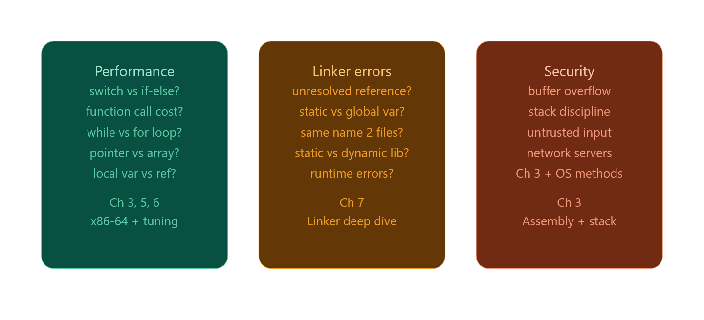

இந்த section short-ஆ இருக்கு, ஆனா மிகவும் important — **"ஏன் compilation system தெரிஞ்சுக்கணும்?"** னு 3 practical reasons சொல்றாங்க. உனக்கு directly relevant-ஆன angle-ல explain பண்றேன்.---



## Reason 1 — Program performance

Book-ல கேக்குற questions எல்லாம் நீ Node.js/C எழுதும்போதும் relevant:

**`switch` vs `if-else`** — Compiler சில situations-ல `switch`-ஐ ஒரு **jump table** ஆக convert பண்ணும். அதாவது `if (x==1)... else if (x==2)...` மாதிரி ஒவ்வொண்ணா check பண்ணாம, `x`-ரோட value-ஐ direct-ஆ memory address-ஆக use பண்ணி O(1)-ல jump பண்ணும். ஆனா always இல்ல — compiler decide பண்றது conditions பொறுத்து.

**Local variable vs reference** — `sum += arr[i]` vs function-க்கு pointer pass பண்ணி அதுல accumulate பண்றது — local variable version faster ஏன்னா compiler அதை register-ல வச்சிருக்கலாம். Pointer version-ல compiler "இந்த pointer aliasing பண்றதா?" னு certain-ஆ தெரியாம, memory-லிருந்து ஒவ்வொரு தடவையும் read பண்ணும்.

இதெல்லாம் "micro-optimization" மாதிரி தெரியலாம், ஆனா hot loop-ல (millions of times run ஆகுற code) இந்த differences 10x performance gap create பண்ணும்.

---

## Reason 2 — Linker errors

இது practically மிகவும் painful. Linker error messages cryptic-ஆ இருக்கும்:

```
undefined reference to `printf'
multiple definition of `count'
cannot find -lssl
```

இவை ஏன் வருது, எப்படி fix பண்றது னு புரியணும்னா linker எப்படி `.o` files-ஐ merge பண்றது, symbol table என்ன, static vs dynamic library difference என்ன னு தெரியணும். Chapter 7-ல இதை cover பண்ணும்.

**Runtime linker error** — இது especially tricky. Compile time-ல error வராது, program run ஆகும்போது `libssl.so not found` மாதிரி crash ஆகும். ஏன்னா dynamic library runtime-ல load ஆகுது.

---

## Reason 3 — Security (Buffer overflow)

இது bug bounty hunting interest-க்கு directly connected! Buffer overflow என்னன்னா:

```c
char buf[8];
gets(buf);  // user "AAAAAAAAAAAAAAAA" (16 chars) type பண்ணா?
```

`buf` 8 bytes மட்டும் — ஆனா `gets()` limit check பண்ணாது. Extra bytes **stack-ல** write ஆகும். Stack-ல **return address** இருக்கு — அந்த address-ஐ overwrite பண்ணினா, function return ஆகும்போது attacker-ரோட code-க்கு jump பண்ணும். இதுதான் classic buffer overflow exploit.

இதை புரிஞ்சுக்க **stack layout** தெரியணும் — local variables, saved registers, return address எல்லாம் stack-ல எந்த order-ல இருக்கு னு. Assembly (Chapter 3) படிக்கும்போது இது automatically clear ஆகும்.

---

## உனக்கான takeaway

இந்த section basically CS:APP-ரோட **"why should I read this book?"** answer. உன் goal (product company software engineer, possibly systems/backend) பொறுத்து இந்த மூன்றும் directly useful:

Performance → hot path code optimize பண்றது, database query loops, Node.js backend throughput. Linker → production build errors debug பண்றது, native addon (.node files) build பண்றது. Security → bug bounty, secure coding, input validation.

Chapter 3 (x86-64 assembly) தான் மூன்றுக்கும் foundation — அதை skip பண்ணாதே.

--------

சரி Jarvis! மூன்றையும் one by one, deep-ஆ, examples-ஓட போகிறேன். நிறுத்தி கேட்கமாட்டேன் — நேரடியா ஆரம்பிக்கிறேன்.

---

# Reason 1 — Program Performance

## Switch vs If-else — Jump Table

இந்த C code பாரு:

```c
int score = 2;

// if-else version
if (score == 1)      printf("Poor");
else if (score == 2) printf("Average");
else if (score == 3) printf("Good");
else if (score == 4) printf("Great");
else                 printf("Unknown");
```

CPU என்ன பண்றது? `score == 1`? No. `score == 2`? Yes — அங்க jump. **Sequential check** — worst case N comparisons.

இதையே compiler `switch`-ஆ பாத்தா:

```c
switch(score) {
    case 1: printf("Poor");    break;
    case 2: printf("Average"); break;
    case 3: printf("Good");    break;
    case 4: printf("Great");   break;
}
```

Compiler இதை assembly-ல ஒரு **jump table** ஆக convert பண்ணும்:

```
jump_table:
  address_of_case1   ← index 0
  address_of_case2   ← index 1
  address_of_case3   ← index 2
  address_of_case4   ← index 3

; Assembly:
mov eax, score         ; score value load பண்று
jmp jump_table[eax]   ; table[score] address-க்கு direct jump
```

`score = 2` னா — compare பண்ணவே வேண்டாம். `jump_table[2]` address-க்கு **O(1)** direct jump. 4 cases இருந்தாலும் 400 cases இருந்தாலும் same speed.

ஆனா compiler always jump table போடுவதில்லை — cases continuous-ஆ இருக்கணும் (1,2,3,4 — ok. 1,50,300 — no, table too sparse, memory waste). Compiler automatic-ஆ decide பண்ணும்.

---

## Local Variable vs Pointer — Aliasing Problem

இந்த example நல்லா பாரு:

```c
// Version A — local variable
long sum_local(long *arr, int n) {
    long sum = 0;
    for (int i = 0; i < n; i++)
        sum += arr[i];
    return sum;
}

// Version B — pointer (reference)
long sum_pointer(long *arr, int n, long *result) {
    *result = 0;
    for (int i = 0; i < n; i++)
        *result += arr[i];
    return *result;
}
```

Version A-ல compiler `sum`-ஐ **register**-ல வச்சுடும்:

```asm
; sum = register %rax — RAM access இல்லவே இல்ல
xor %rax, %rax        ; sum = 0
loop:
  add (%rdi), %rax    ; sum += arr[i]  ← RAM once, register once
  ...
```

Version B-ல compiler ஒரு problem face பண்றது: `result` pointer `arr`-ரோட same memory-ஐ point பண்றதா? (`arr[0]` மேல `result` overlap பண்றதா?). இதை **pointer aliasing** னு சொல்வாங்க.

Compiler certain-ஆ தெரியாத காரணத்தால் safe-ஆ ஒவ்வொரு iteration-லயும் `*result`-ஐ RAM-லிருந்து read+write பண்ணும்:

```asm
loop:
  mov (%rdi), %rax     ; arr[i] load
  add (%rdx), %rax     ; *result load from RAM ← extra RAM access!
  mov %rax, (%rdx)     ; *result write back to RAM ← extra RAM write!
```

Hot loop-ல (10 million iterations) — Version A register மட்டும் தொடும், Version B ஒவ்வொரு iteration-லயும் RAM தொடும். **Cache miss இல்லன்னா கூட** extra memory operations = slower.

Fix: C99-ல `restrict` keyword:

```c
long sum_pointer(long *arr, int n, long *restrict result) {
```

`restrict` = "இந்த pointer வேற எந்த pointer-உம் point பண்றதை overlap பண்ணல" னு compiler-க்கு promise. அப்போ compiler Version A மாதிரியே optimize பண்ணும்.

---

## While vs For — இது almost same

```c
// Both compile to identical assembly in most cases
for (int i = 0; i < n; i++) { ... }

int i = 0;
while (i < n) { i++; ... }
```

GCC இரண்டையும் same assembly-ல output பண்றது. Real difference இல்ல. Book இதை mention பண்றது programmers-க்கு "obvious-ஆ தெரியுற differences always real differences இல்ல" னு சொல்ல.

---

## Parentheses Rearrangement — FP Arithmetic

```c
// Version A
double result = (a + b) + c;

// Version B
double result = a + (b + c);
```

இது same-ஆ தெரியுது, ஆனா **floating point** numbers-க்கு associative இல்ல! `(1e20 + -1e20) + 1.0 = 1.0`, ஆனா `1e20 + (-1e20 + 1.0) = 0.0` (precision loss). அதனால compiler by default FP expressions-ஐ reorder பண்ணாது.

`-ffast-math` flag போட்டா compiler aggressively reorder பண்ணும், speed up ஆகும், ஆனா FP precision slightly change ஆகலாம். Scientific computing-ல இது matter ஆகும்.

---

# Reason 2 — Linker Errors (Deep)

## Symbol Table — Linker-ரோட core

`.o` file (object file) compile ஆகும்போது அதுல ஒரு **symbol table** இருக்கும். அது basically ஒரு list:

```
DEFINED symbols (இந்த file-ல இருக்கற functions/variables):
  main         → address 0x00 (placeholder)
  count        → address 0x20

UNDEFINED symbols (வேற file-லிருந்து வேணும்):
  printf       → ???
  openssl_init → ???
```

Linker எல்லா `.o` files-ரோட symbol tables-ஐ collect பண்ணி, undefined-ஐ defined-ல match பண்ணும்.

---

## Error 1: `undefined reference to 'printf'`

```
$ gcc hello.o -o hello
/usr/bin/ld: hello.o: undefined reference to symbol 'printf'
```

ஏன் வருது? `hello.o`-ல `printf` undefined — ஆனா C standard library (`libc`) link பண்ணல. GCC normally auto-link பண்ணும், ஆனா manually link பண்ணும்போது:

```bash
gcc hello.o -lc -o hello   # libc explicit-ஆ சொல்லணும்
# அல்லது simply:
gcc hello.o -o hello       # gcc auto-ஆ libc add பண்ணும்
```

---

## Error 2: `multiple definition of 'count'`

```c
// file1.c
int count = 0;

// file2.c
int count = 0;   // same name!
```

```
$ gcc file1.o file2.o -o app
multiple definition of 'count'; file1.o first defined here
```

Linker symbol table-ல `count` இரண்டு places-ல defined — எதை use பண்றது? Ambiguous, so error.

Fix — `static` keyword:

```c
// file1.c
static int count = 0;  // இந்த variable file1.c-க்கு மட்டும், outside invisible
```

`static` global variable = **file-local scope**. Symbol table-ல external-ஆ export ஆகாது. இப்போ conflict இல்ல.

---

## Static Library vs Dynamic Library

```
libmath.a  ← static library (.a = archive)
libmath.so ← dynamic/shared library (.so = shared object)
```

**Static linking:**

```bash
gcc main.o -lmath_static -o app
```

`libmath.a`-லிருந்து தேவையான `.o` files எல்லாம் `app` executable-ல **copy** ஆகும். Final binary பெரிசா இருக்கும், ஆனா self-contained — system-ல library இல்லாமலயே run ஆகும்.

**Dynamic linking:**

```bash
gcc main.o -lmath -o app
```

`app` binary-ல `libmath.so` reference மட்டும் இருக்கும். `./app` run பண்ணும்போது OS `libmath.so`-ஐ **runtime-ல load** பண்ணும். Binary சின்னதா இருக்கும், ஆனா system-ல `libmath.so` இருக்கணும்.

**Runtime linker error:**

```bash
$ ./app
./app: error while loading shared libraries: libssl.so.1.1: cannot open shared object file
```

Compile time-ல இல்ல — runtime-ல crash. ஏன்னா `libssl.so` system-ல இல்ல அல்லது wrong version. Fix:

```bash
sudo apt install libssl-dev
# அல்லது
export LD_LIBRARY_PATH=/path/to/lib:$LD_LIBRARY_PATH
```

---

## Library Order on Command Line — இது tricky!

```bash
# WRONG — error!
gcc -lmath main.o -o app

# CORRECT
gcc main.o -lmath -o app
```

Linker left-to-right scan பண்றது. `-lmath` முதல்ல வந்தா, அந்த நேரத்துல `main.o` யாரும் `sin()` request பண்ணல — linker "யாரும் use பண்றதில்லை" னு skip பண்ணிடும். `main.o` அப்புறம் வரும்போது `sin()` undefined!

Rule: **libraries always after the object files that use them.**

---

# Reason 3 — Buffer Overflow (Security)

## Stack Layout — முதல்ல இதை புரிஞ்சுக்கோ

ஒரு function call ஆகும்போது stack-ல என்ன push ஆகுது:

```
High address
┌─────────────────┐
│  caller's frame │
├─────────────────┤
│  return address │ ← "function முடிஞ்சதும் எங்க திரும்பணும்"
├─────────────────┤
│  saved %rbp     │ ← caller-ரோட base pointer save
├─────────────────┤
│  local vars     │ ← char buf[8] இங்கே
│  buf[0..7]      │
└─────────────────┘
Low address  (stack grows downward)
```

`buf[8]` — 8 bytes. Stack-ல `buf` கீழே, return address மேலே.

---

## Attack எப்படி நடக்குது

```c
void vulnerable() {
    char buf[8];
    gets(buf);   // NO bounds checking!
}

int main() {
    vulnerable();
    return 0;
}
```

Normal input `"Hello"` (5 bytes):

```
buf: H e l l o \0 _ _    (8 bytes, fine)
return address: 0x401234  (untouched)
```

Attack input — 16 bytes `"AAAAAAAABBBBBBBB"`:

```
buf: A A A A A A A A    (8 bytes — buf full)
return address: B B B B B B B B  ← OVERWRITTEN!
```

`vulnerable()` return ஆகும்போது CPU `0x4242424242424242` (`BBBBBBBB`) address-க்கு jump பண்றது. அந்த address-ல attacker-ரோட shellcode இருந்தா — **system compromised.**

Real exploit-ல `BBBBBBBB` random இல்ல — attacker carefully crafted address, usually stack-ல அவங்களே inject பண்ண shellcode-ரோட address.

---

## Modern Defenses

**Stack canary** — Compiler buffer-க்கும் return address-க்கும் நடுவே ஒரு random value (canary) வைக்கும். Function return-க்கு முன்னாடி அந்த value check பண்ணும். Overflow ஆனா canary மாறும் — program abort.

```
buf[8] | CANARY(random) | return address
```

**ASLR (Address Space Layout Randomization)** — OS ஒவ்வொரு run-லயும் stack/heap/library addresses randomize பண்றது. Attacker hardcoded address use பண்ண முடியாது.

**NX bit (No-Execute)** — Stack memory-ஐ executable-ஆ mark பண்ணாது. Stack-ல inject பண்ண code run ஆகாது.

இந்த defenses bypass பண்றதுதான் modern exploit techniques (ROP — Return Oriented Programming) — இதை bug bounty path-ல later பாக்கலாம்.

---

## மூன்றின் connection

இந்த மூன்று reasons-உம் ஒரே root-லிருந்து வருது: **machine-level-ல என்ன நடக்குது னு தெரியணும்.** Assembly தெரியாம performance tuning பண்ண முடியாது, linker symbols புரியாம link errors fix பண்ண முடியாது, stack layout தெரியாம buffer overflow புரியாது. அதனால CS:APP Chapter 3 (x86-64 assembly) இந்த மூன்றுக்கும் gateway.

அடுத்து 1.4 (Hardware Organization) போகலாமா?