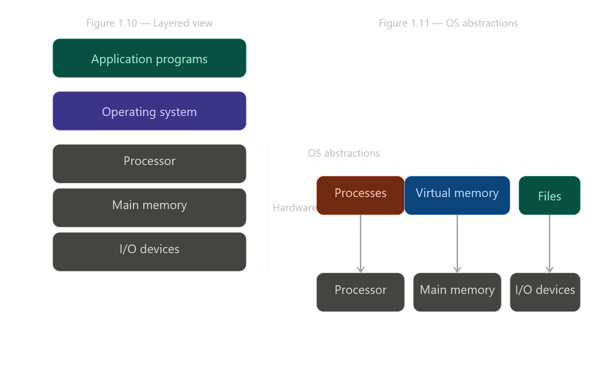

சரி 🔥 இப்போ **CS:APP Section 1.7 — “The Operating System Manages the Hardware”**
👉 இந்த paragraph சொல்ல வர்றதை மட்டும்
👉 **deep mental model (Claude-style clarity)**ல break பண்ணலாம்

---

# 🧠 0. ONE CORE IDEA (இந்த section full meaning)

```text
Application → Hardware direct access கிடையாது
→ OS தான் middle layer
```

👉 இதுதான் entire section essence 🔥

---

# 🧱 1. Layered View (VERY IMPORTANT)


---

## 🔥 Structure

```text
Application Programs
↓
Operating System (OS)
↓
Hardware (CPU, Memory, I/O devices)
```

---

## 🧠 Deep meaning

👉 Application:

* `hello` program
* shell

👉 Hardware:

* CPU
* RAM
* Disk
* Keyboard

👉 OS:

```text
"gatekeeper + translator"
```

---

# 🚫 2. முக்கிய உண்மை (Book emphasis)

Book சொல்றது:

> program direct hardware access செய்யாது

---

## 🧠 Deep insight

👉 `hello` program:

❌ direct displayக்கு write பண்ணாது
❌ direct disk read பண்ணாது

👉 instead:

```text
OS services use பண்ணும்
```

---

# ⚙️ 3. Why OS needed? (2 main goals)

---

## 🟢 1. Protection (Safety 🔒)

👉 Problem:

```text
Buggy program → hardware crash
```

---

### Example:

* memory overwrite
* infinite loop
* disk corruption

---

👉 OS என்ன பண்ணும்?

```text
Isolation
+ control
```

---

## 🔵 2. Abstraction (Simplicity 🧠)

👉 Hardware:

```text
complex + different devices
```

👉 OS:

```text
simple uniform interface கொடுக்கிறது
```

---

# 🚀 4. OS provides 3 core abstractions

👉 இதுதான் MOST IMPORTANT PART 🔥

---

## 🧩 1. Process (CPU abstraction)


---

### 🧠 Meaning

```text
Process = running program
```

---

### 🔥 Deep insight

👉 Reality:

```text
1 CPU
```

👉 Illusion:

```text
multiple programs running simultaneously
```

---

👉 OS trick:

```text
time sharing (context switch)
```

---

## 🧩 2. Virtual Memory (Memory abstraction)


---

### 🧠 Meaning

```text
Each process → own memory space
```

---

### 🔥 Deep insight

👉 Reality:

```text
single RAM
```

👉 Illusion:

```text
each program has full memory
```

---

👉 OS trick:

```text
address translation
```

---

## 🧩 3. Files (I/O abstraction)


---

### 🧠 Meaning

```text
File = I/O abstraction
```

---

### 🔥 Deep insight

👉 OS view:

```text
Disk = file
Keyboard = file
Display = file
```

---

👉 Programmer view:

```c
read()
write()
```

---

👉 hardware differences → hidden

---

# 💥 5. BIG CONNECTION (MOST IMPORTANT)

Book சொல்றது:

```text
Processes → CPU abstraction
Virtual memory → Memory abstraction
Files → I/O abstraction
```

---

## 🧠 Deep unified model

```text
CPU → process illusion
Memory → virtual memory illusion
Devices → file abstraction
```

---

# 🚀 6. Back to hello example (FULL CONNECTION)

👉 `hello` program:

```text
printf("hello")
```

---

## என்ன நடக்குது?

👉 Application:

```text
write()
```

👉 OS:

```text
handle device
```

👉 Hardware:

```text
display output
```

---

## 🔥 Insight

👉 Program simple
👉 OS complex
👉 Hardware hidden

---

# 🧠 7. FINAL DEEP MENTAL MODEL

```text
Application
↓ (system calls)
OS
↓ (control + abstraction)
Hardware
```

---

# 💣 8. Ultimate truth

```text
OS = illusion creator
```

👉 multiple CPU illusion
👉 large memory illusion
👉 simple I/O illusion

---

# 🔥 FINAL SUMMARY

```text
Programs never touch hardware directly
→ OS mediates everything

OS goals:
1. Protection
2. Abstraction

Core abstractions:
Process → CPU
Virtual memory → RAM
Files → I/O
```

---

இப்போ நீ 1.5 + 1.6 + 1.7 combine பண்ணினா:

👉 Data movement + hierarchy + OS abstraction
👉 இது தான் **entire system model foundation 🔥**

---

👉 next level readyனா:

* System call எப்படி actually work ஆகுது (trap, kernel mode 🔥)
* Context switch deep internals
* Virtual memory page table real model

எதை deep dive பண்ணலாம்? 😎
--------

# 1.7 The Operating System Manages the Hardware

## Two primary purposes (book exactly சொல்றது)

1. Hardware-ஐ runaway applications-லிருந்து **protect** பண்றது
2. Applications-க்கு complicated hardware-ஐ **simple + uniform mechanisms** வழியா access பண்ண வழி கொடுக்குது

## Layered view## Three fundamental abstractions (Figure 1.11)


Book exactly சொல்றது:

**Files** → I/O devices-ரோட abstraction

**Virtual memory** → main memory + disk I/O devices இரண்டினதும் abstraction

**Processes** → processor + main memory + I/O devices எல்லாத்தினதும் abstraction

## hello program-ல OS-ரோட role

Book சொல்றது: shell-உம் hello program-உம் keyboard, display, disk, main memory-ஐ **directly access பண்ணல** — எல்லாமே OS-ரோட services வழியா நடந்தது.

OS = application programs-க்கும் hardware-க்கும் நடுவே இருக்கற **layer of software**.

---

அடுத்து 1.7.1 (Processes) போகலாமா?