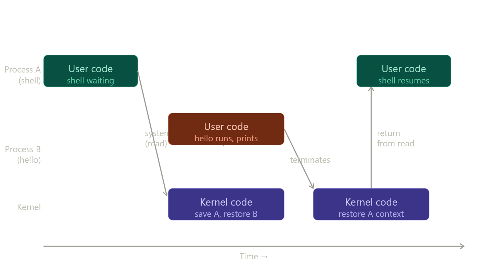

# 1.7.1 Processes

## Core idea — Illusion of exclusivity

Book-ரோட exact words: hello program run ஆகும்போது OS மூன்று illusions கொடுக்குது:

1. Processor-ஐ தான் மட்டும் use பண்றது மாதிரி தெரியும்
2. Main memory தான் மட்டும் use பண்றது மாதிரி தெரியும்
3. I/O devices தான் மட்டும் use பண்றது மாதிரி தெரியும்

இந்த illusion-ஐ கொடுக்கும் mechanism-தான் **process**.

---

## Process = running program-ரோட OS abstraction

Multiple processes same system-ல concurrently run ஆகலாம். **Concurrently** = ஒரு process-ரோட instructions வேற process-ரோட instructions-ஓட interleave ஆகுது.

CPUs-ஐ விட processes எப்பவும் அதிகமா இருக்கும் — single CPU multiple processes-ஐ **context switching** மூலம் handle பண்றது.

---

## Context என்னது

OS ஒவ்வொரு process-ரோட **context** track பண்றது:

```
Context includes:
  - Current PC value
  - Register file contents
  - Main memory contents
```

இந்த context save/restore பண்றதுதான் context switch.

---

## Context Switch — Figure 1.12

## hello scenario — exact flow (book சொல்றது)

```
1. Shell process alone running — command line wait பண்றது

2. ./hello type பண்ணும்போது:
   Shell → system call → control passes to OS

3. OS:
   Shell-ரோட context save பண்றது
   hello process + its context create பண்றது
   hello-க்கு control pass பண்றது

4. hello terminates:
   OS shell-ரோட context restore பண்றது
   Shell-க்கு control pass பண்றது

5. Shell: next command-line input wait பண்றது
```

---

## Kernel — Important clarification (book exactly சொல்றது)

**Kernel = separate process இல்ல.**

Kernel என்பது:
- OS code-ரோட portion — always memory-ல resident
- All processes-ஐ manage பண்ற code + data structures collection

Application program OS action வேணும்னா (file read/write) → **system call instruction** execute பண்றது → control kernel-க்கு transfer → kernel operation perform பண்றது → application-க்கு return.

---

## Book-ரோட note

> "Implementing the process abstraction requires close cooperation between both the low-level hardware and the operating system software."

Chapter 8-ல processes எப்படி work ஆகுது, applications எப்படி own processes create + control பண்றது னு cover ஆகும்.

அடுத்து 1.7.2 (Threads) போகலாமா?