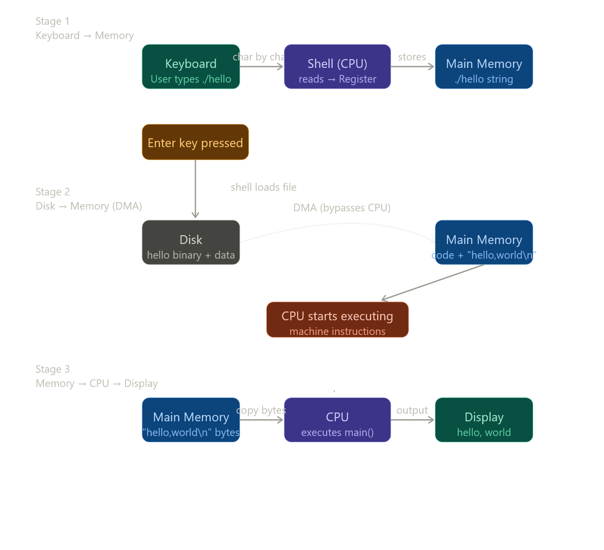

சரி Jarvis! இந்த section-ல என்ன நடக்குது னு step-by-step, deep-ஆ பார்க்கலாம். முதல்ல ஒரு diagram பார்க்கலாம், அப்புறம் ஒவ்வொரு stage-யும் விளக்குறேன்.

**`./hello` type பண்ணும்போது என்ன ஆகுது** — 3 major stages இருக்கு:இப்போ ஒவ்வொரு stage-யும் deep-ஆ பார்க்கலாம்.



---

## Stage 1 — Keyboard → Shell → Memory

நீ `./hello` type பண்றப்போ, keyboard-ல press பண்ற ஒவ்வொரு character-உம் ஒரு **electrical signal** ஆகுது. அந்த signal USB controller வழியா **I/O bus**-க்கு போகும். அங்கிருந்து CPU-ல இருக்குற **shell process** அந்த character-ஐ ஒரு **register**-ல படிக்கும் (register = CPU-க்குள்ளே இருக்கற மிகவும் fast memory, just ஒரு variable மாதிரி).

Shell அந்த character-ஐ register-ல மட்டும் வச்சிருக்காது — உடனே **main memory (RAM)**-ல store பண்ணும். ஏன்னா register-ல space மிகவும் குறைவு, temporary-தான். இப்படி ஒவ்வொரு key-உம் RAM-ல சேரும், `./hello` முழுசா ஒரு **string** ஆகி memory-ல உட்கார்ந்திருக்கும்.

---

## Stage 2 — Enter key → DMA → Memory

Enter அடிக்கும்போது shell "command complete" னு தெரிஞ்சுக்கும். இப்போ shell ஒரு sequence of instructions execute பண்ணும் — அந்த instructions `hello` **executable file**-ஐ disk-லிருந்து load பண்ணும்.

இங்கே மிக முக்கியமான concept: **DMA (Direct Memory Access)**.

Normally data-ஐ move பண்ண CPU-யே handle பண்ணணும். But disk → RAM transfer மிகவும் slow + large. CPU-ஐ இதுக்கே block பண்ணா waste. அதனால **DMA controller** னு ஒரு separate hardware இருக்கு. அது CPU-ஐ விட்டுடாம நேரடியா **disk → RAM**-க்கு data copy பண்ணும். CPU இந்த நேரத்துல வேற வேலை பார்க்கலாம்.

DMA transfer முடிஞ்சதும் RAM-ல என்ன இருக்கும்? `hello` program-ரோட **machine code instructions** + `"hello, world\n"` string data — இரண்டும் memory-ல ready.

---

## Stage 3 — CPU executes → Display

இப்போ CPU-க்கு control போகும். **Program Counter (PC)** register `hello` program-ரோட `main()` function-ரோட first instruction-ஐ point பண்ணும். CPU அந்த instruction-ஐ **fetch** பண்ணும், **decode** பண்ணும், **execute** பண்ணும் — இதை **fetch-decode-execute cycle** னு சொல்வாங்க.

`main()` function என்ன பண்ணும்? `printf("hello, world\n")` call பண்ணும். இது இந்த bytes-ஐ RAM-லிருந்து CPU register-க்கு copy பண்ணும், அங்கிருந்து **I/O bus வழியா graphics adapter**-க்கு அனுப்பும். Graphics adapter அந்த bytes-ஐ screen-ல characters ஆக render பண்ணும்.

---

## ஒரு key insight

இந்த whole process-ல data **3 தடவை** copy ஆகுது:
1. Keyboard → RAM (shell படிக்கும்போது)
2. Disk → RAM (DMA load)
3. RAM → CPU registers → Display

இதை CS:APP book **"the memory mountain"** concept-ல explain பண்ணும் — data எவ்வளவு தூரம் travel பண்றதோ, அவ்வளவு slow. அதனால cache hierarchy (L1, L2, L3) exist பண்றது — இதை book-ல Section 1.5 "Caches Matter"-ல அடுத்து cover பண்ணும்!

----------------

இந்த section-தான் எல்லா concepts-உம் ஒன்னா combine ஆகுற இடம். Keyboard type பண்றதிலிருந்து screen-ல தெரியுற வரைக்கும் hardware-level-ல என்ன நடக்குது னு full trace பண்ணலாம்.

---

# Full Hardware Trace — `./hello` type பண்றதிலிருந்து output வரைக்கும்இப்போ ஒவ்வொரு phase-யும் clock cycle level-ல என்ன நடக்குது னு deep-ஆ போகிறேன்.

---

# Phase 1 — Keyboard → Shell → RAM

## Key press-லிருந்து RAM-வரை exact steps

நீ `.` key press பண்றப்போது:

```
1. Key press → keyboard matrix circuit closes
   Keyboard controller: scancode generate பண்றது
   '.' = scancode 0x34

2. USB HID (Human Interface Device) protocol:
   Keyboard → USB packet → USB cable → 
   Motherboard USB controller chip

3. USB Controller → CPU interrupt (IRQ1)
   CPU: current instruction முடிக்கும்
   Registers save (context switch)
   Interrupt handler jump

4. Kernel keyboard interrupt handler runs:
   USB controller-லிருந்து scancode read
   Scancode → ASCII: 0x34 → '.' (0x2E)
   Kernel input buffer-ல store

5. Shell process:
   read() syscall → kernel buffer-லிருந்து '.' get
   Shell: register-ல load பண்றது
   Shell: own memory buffer-ல store

6. இதே process ஒவ்வொரு character-க்கும்:
   '.' → '/' → 'h' → 'e' → 'l' → 'l' → 'o'
   
   RAM-ல shell-ரோட buffer:
   [0x2E][0x2F][0x68][0x65][0x6C][0x6C][0x6F]
    '.'   '/'   'h'   'e'   'l'   'l'   'o'
```

## Enter key — trigger point

```
Enter press → '\n' (0x0A) arrives in shell buffer

Shell's main loop:
while (1) {
    read_command();      // blocking read()
    if (newline found) {
        parse_command(); // "./hello" extracted
        execute();       // fork + exec
    }
}

Shell checks: "./hello" built-in-ஆ? → NO
Shell checks: "./hello" file exists-ஆ? → YES (executable bit set)
Decision: fork() + execve("./hello")
```

---

# Phase 2 — Disk → RAM via DMA

## Shell → OS → Disk controller → DMA exact flow

```
Shell calls: execve("./hello", argv, envp)

OS (kernel) takes over:
  1. "./hello" file open பண்றது
  2. ELF header read பண்றது (file format check)
  3. Program segments identify பண்றது:
     - .text segment (code): load to 0x401000
     - .rodata segment (string): load to 0x402000
     - .data segment: load to 0x404000
  4. Virtual memory pages allocate பண்றது
  5. Disk controller-க்கு command:
     "Sector X, Y blocks → RAM address 0x401000"
```

## DMA — CPU-ஐ bypass பண்றது

```
Without DMA (old method — Programmed I/O):
  CPU: read 1 word from disk controller
  CPU: write 1 word to RAM
  CPU: repeat 10,000 times for hello binary
  CPU 100% busy, doing memory copy work!

With DMA:
  CPU → DMA controller:
    src  = disk sector address
    dst  = RAM 0x401000
    size = hello binary size (say 16KB)
    GO!
  
  CPU: FREE — can run other processes!
  
  DMA controller independently:
    Disk controller → I/O bus → DMA → Memory bus → RAM
    16KB copy நடக்கும் (CPU இல்லாம்!)
  
  DMA done → ONE interrupt to CPU:
    "16KB copied to 0x401000. Done."
  
  CPU: acknowledge, continue
```

## RAM-ல hello program layout after load

```
Virtual Address    Content
───────────────────────────────────────────────
0x400000          ELF header (metadata)
0x401000          .text — machine instructions
  0x401020:       main:
  0x401020:         push %rbp
  0x401021:         mov  %rsp, %rbp
  0x401024:         sub  $0x8, %rsp
  0x401028:         lea  0x402000, %rdi  ← string address load
  0x40102F:         call printf
  0x401034:         mov  $0, %eax
  0x401039:         leave
  0x40103A:         ret

0x402000          .rodata — read-only data
  0x402000:       68 65 6C 6C 6F 2C 20  "hello, "
  0x402007:       77 6F 72 6C 64 0A 00  "world\n\0"

0x7fff0000        Stack (grows down)
  return address, saved registers...
```

---

# Phase 3 — CPU executes main() → Display

## PC = main() address → execution begins

```
OS: PC = 0x401020  (main function start)
CPU fetch-decode-execute loop begins:

━━━ Instruction 1 ━━━
Fetch:   memory[0x401020] = 0x55 (push %rbp)
Decode:  STORE operation — push rbp onto stack
Execute: RAM[rsp-8] = rbp; rsp = rsp - 8
PC:      0x401020 + 1 = 0x401021

━━━ Instruction 2 ━━━
Fetch:   memory[0x401021] = 0x48 0x89 0xE5 (mov %rsp,%rbp)
Decode:  OPERATE — copy rsp to rbp
Execute: rbp = rsp
PC:      0x401021 + 3 = 0x401024

━━━ Key Instruction ━━━
Fetch:   memory[0x401028] = 0x48 0x8D 0x3D ... (lea .rodata, %rdi)
Decode:  LOAD address — load string address into rdi
Execute: rdi = 0x402000  ← "hello, world\n" address
PC:      next

━━━ Call printf ━━━
Fetch:   memory[0x40102F] = 0xE8 ... (call printf)
Decode:  JUMP + push return address
Execute: RAM[rsp-8] = 0x401034 (return addr pushed)
         PC = printf function address
```

## printf → write syscall → kernel → display

```
printf internal flow:
  1. format string parse: no format specifiers
  2. string length calculate: 13 bytes
  3. write(1, 0x402000, 13) syscall
     fd=1 = stdout

Kernel write() handler:
  1. fd 1 = terminal (tty device)
  2. 13 bytes copy: RAM[0x402000..0x40200C]
     h  e  l  l  o  ,     w  o  r  l  d  \n
     68 65 6C 6C 6F 2C 20 77 6F 72 6C 64 0A
  3. Terminal driver → VT100 escape processing
  4. Framebuffer update:
     Each character → font bitmap lookup
     Pixels write to GPU framebuffer memory

GPU:
  Framebuffer → HDMI/DisplayPort signal
  Monitor: pixels light up
  "hello, world" visible!
```

## Data copy count — total times "hello, world" copied

```
1. Disk sectors → RAM (DMA, Phase 2)
   RAM[0x402000] = "hello, world\n"

2. RAM → CPU register (LOAD instruction)
   rdi = 0x402000 (address, not data itself)

3. printf → write syscall
   kernel copies 13 bytes: RAM → kernel buffer

4. Kernel → GPU framebuffer
   13 bytes → pixel data → VRAM

5. GPU VRAM → Monitor
   HDMI signal

Total: 4 copies of the string data!
```

CS:APP-ரோட point: இந்த copies எல்லாம் **overhead**. "hello, world" print பண்றதுதான் "real work" — மத்தது எல்லாம் infrastructure cost. Caches இந்த copies-ஐ fast-ஆ பண்றது.

---

# Complete Timeline — Clock cycles-ல

```
Event                          Approx cycles
──────────────────────────────────────────────
Key press → RAM store          ~10,000 cycles
  (USB interrupt + kernel)

fork() + execve()              ~100,000 cycles
  (OS setup, page tables)

DMA: disk → RAM                ~50,000,000 cycles
  (disk seek + transfer)       (disk is SLOW)

CPU executes main()            ~1,000 cycles
  (fetch-decode-execute)

printf → write syscall         ~5,000 cycles
  (kernel + GPU update)

GPU → Monitor                  one frame = 16ms
  (60Hz refresh)               ~48,000,000 cycles
```

Interesting: actual `main()` execution = ~1000 cycles. ஆனா disk load = 50 million cycles. **Program-ரோட "real work" total time-ரோட 0.002%!** மீதி எல்லாம் I/O wait.

இதுதான் "I/O-bound vs CPU-bound" programs-ரோட fundamental difference. `hello` = I/O bound (disk load dominate). Matrix multiplication = CPU bound (ALU dominate).

Node.js-ரோட entire existence இந்த insight-ல இருந்து வருது — I/O wait நேரத்துல CPU-ஐ waste பண்ணாம event loop-ல வேற requests handle பண்றது.