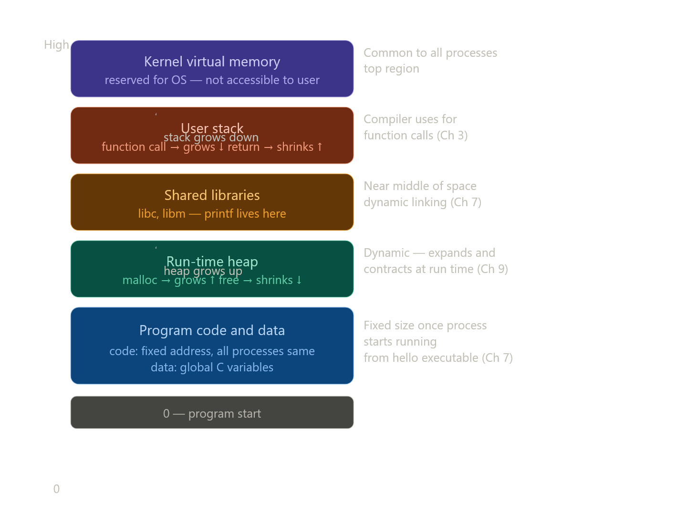

# 1.7.3 Virtual Memory

## Core idea

Virtual memory = each process-க்கு main memory-ஐ தான் மட்டும் exclusively use பண்றது மாதிரி **illusion** கொடுக்குது. ஒவ்வொரு process-உம் same uniform view — **virtual address space**.

---

## Virtual Address Space — 5 regions (bottom to top)

---

## ஒவ்வொரு region-உம் — book exact points

**Program code and data** — Code same fixed address-ல எல்லா processes-க்கும் begin ஆகும். Global C variables-க்கான data locations follow ஆகும். Hello executable-லிருந்து directly initialize ஆகும். (Ch 7)

**Heap** — Code and data areas-க்கு immediately அடுத்து. Fixed size இல்ல — `malloc` and `free` calls-ல dynamically expand and contract ஆகும். (Ch 9)

**Shared libraries** — Address space middle-ல. C standard library, math library போன்றவை இங்க இருக்கும். (Ch 7 — dynamic linking)

**User stack** — Virtual address space-ரோட top-ல (kernel-க்கு கீழே). Function call → stack grows. Return → stack contracts. (Ch 3)

**Kernel virtual memory** — Top region. Application programs இந்த area-ஐ read/write பண்ண **allowed இல்ல**. Kernel functions directly call பண்ண **allowed இல்ல**. Kernel invoke பண்ணணும் — system call வழியா மட்டும்.

---

## Virtual memory-ரோட underlying mechanism (book சொல்றது)

> "The basic idea is to store the contents of a process's virtual memory on disk and then use the main memory as a cache for the disk."

Virtual memory work ஆக hardware + OS software-ரோட **sophisticated interaction** தேவை — processor generate பண்ற every address-ஐ hardware translate பண்றது. Chapter 9-ல deep explanation வரும்.

---

அடுத்து 1.7.4 (Files) போகலாமா?