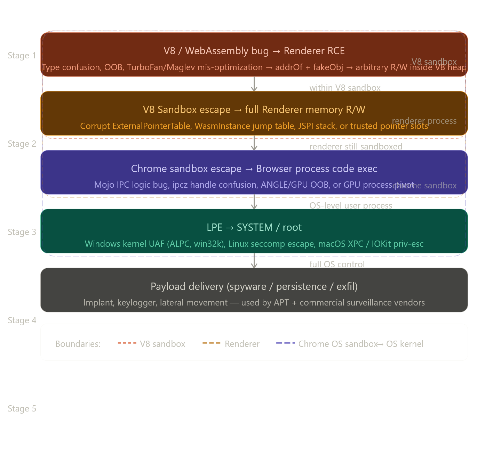

# 🧠 Final Roadmap — Browser Engine + Exploitation

---



## 1️⃣ Computer Systems Fundamentals

**Start with how computers actually run programs.**

**Books:**
```
Computer Systems: A Programmer's Perspective
Modern x86 Assembly Language Programming
```

**Learn:**
```
memory layout
stack vs heap
CPU pipeline
assembly instructions
compiler behavior
```

✔ These are essential for memory corruption bugs

---

## 2️⃣ Core C / C++ Mastery

**Books:**
```
Programming: Principles and Practice Using C++
Effective Modern C++
C++20: The Complete Guide
A Tour of C++
```

**Topics:**
```
RAII
templates
move semantics
smart pointers
undefined behavior
```

✔ Browsers like Chromium are mostly C++

---

## 3️⃣ Algorithms + Problem Solving

**Books:**
```
Introduction to Algorithms
Programming Pearls
```

**Why Programming Pearls matters:**
```
teaches algorithmic thinking
teaches performance-oriented coding
teaches debugging strategies
```

**Example mindset from the book:**
```
Write correct code
      ↓
Measure performance
      ↓
Optimize only the bottleneck
```

✔ This mindset is used in systems engineering

---

## 4️⃣ Mathematics for Computer Science

**Books:**
```
Discrete Mathematics and Its Applications
Introduction to Probability
```

**Used for:**
```
algorithm reasoning
graph structures
fuzzing strategies
complexity analysis
```

---

## 5️⃣ Multithreading / Concurrency ⚡

**Book:**
```
C++ Concurrency in Action
```

**Topics:**
```
threads
atomics
memory ordering
lock-free programming
race conditions
false sharing
```

**Example:**
```cpp
std::atomic<int> counter{0};
counter++;
```

**Very important for browsers because:**
```
JavaScript engine threads
rendering threads
network threads
GPU process
```

**Concurrency bugs can cause:**
```
race conditions
use-after-free
```

---

## 6️⃣ Linux Systems Programming

**Books:**
```
The Linux Programming Interface
UNIX Network Programming
Systems Performance: Enterprise and the Cloud
```

**Topics:**
```
processes
threads
IPC
sockets
epoll
system calls
```

✔ Browsers interact heavily with the OS kernel

---

## 7️⃣ Performance Engineering

**Book:**
```
Optimizing Software in C++
```

**Learn:**
```
cache locality
CPU pipelines
branch prediction
memory alignment
```

**Example performance idea:**
```
Bad:  random memory access
Good: sequential memory access
```

✔ Critical for high-performance engines like V8

---

## 8️⃣ Browser Architecture

**Book:**
```
Web Browser Engineering
```

**Topics:**
```
HTML parser
CSS parser
DOM tree
layout engine
rendering pipeline
```

**Browser pipeline:**
```
HTML
 ↓
DOM
 ↓
CSS styles
 ↓
Layout
 ↓
Paint
 ↓
Screen
```

✔ This explains Blink rendering engine concepts

---

## 9️⃣ Security Research / Exploitation

**Books:**
```
The Art of Software Security Assessment
The Shellcoder's Handbook
Fuzzing for Software Security Testing and Quality Assurance
Practical Binary Analysis
Attacking Network Protocols
```

**Topics:**
```
reverse engineering
fuzzing
exploit development
memory corruption
```

**Example vulnerability:**
```
Use-after-free
      ↓
Corrupt pointer
      ↓
Control instruction pointer
      ↓
Remote code execution
```

---

## 🔟 V8 Engine Internals (Final Step)

**After everything above — Study V8 JavaScript engine.**

**Important concepts:**
```
bytecode interpreter
hidden classes
inline caching
JIT compiler
garbage collection
```

**Flow:**
```
JavaScript
    ↓
V8 bytecode
    ↓
JIT optimized machine code
```

✔ Most Chrome vulnerabilities come from V8 bugs

---

## 🎯 Final Skill Set After This Roadmap

**You will understand:**
```
Computer architecture
Assembly
C/C++
Algorithms
Concurrency
Operating systems
Networking
Browser engines
JavaScript engines
Binary exploitation
Fuzzing
```

✔ This combination is exactly what elite browser security researchers know

---

## ✅ Final Answer

> Yes — adding **C++ Concurrency in Action** and **Programming Pearls** makes your roadmap complete and well-balanced.